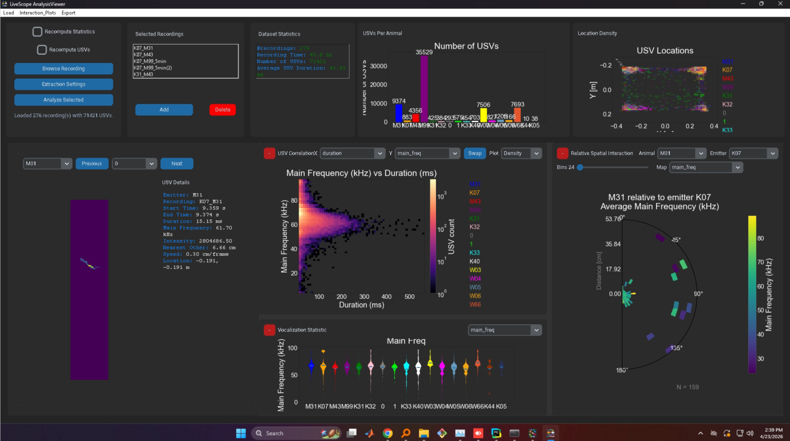
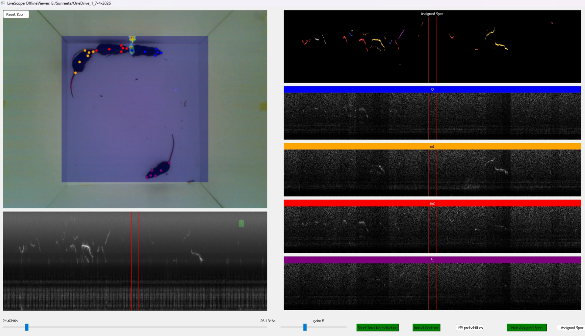
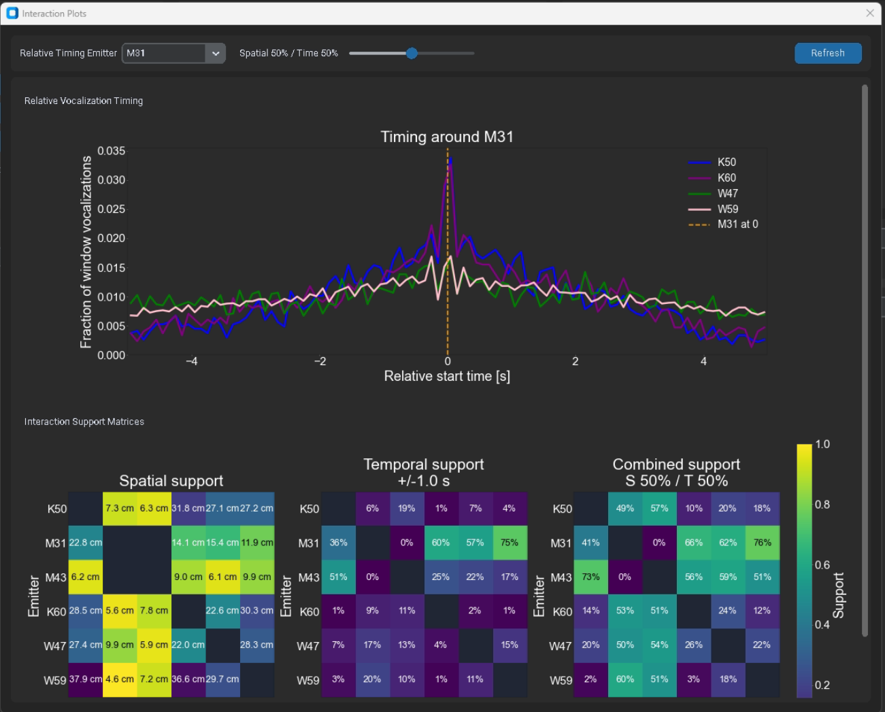
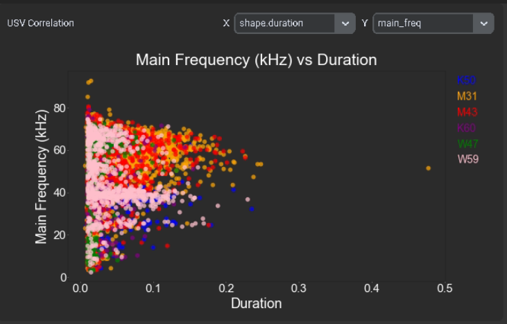
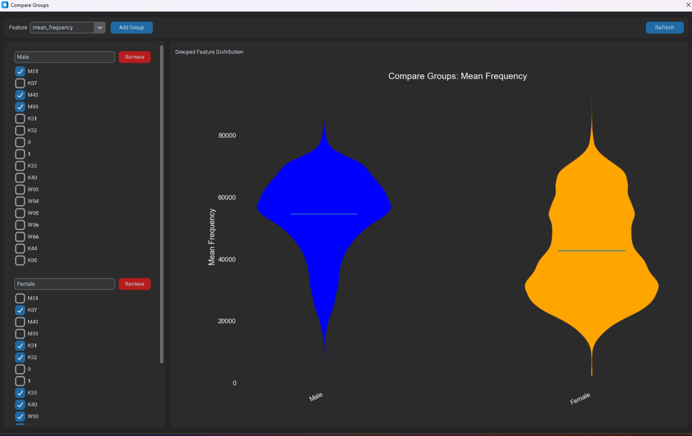

# LiveScope DAS ONNX Export and Inference Tool

A Windows desktop tool for converting Deep Audio Segmenter (DAS) Keras models (`.h5`) into ONNX and running inference with ONNX Runtime, CUDA, and NVIDIA TensorRT.

This tool was written for the LiveScope workflow, where ultrasonic vocalization (USV) detection and classification are part of a larger analysis pipeline for linking vocalizations to individual animals, spatial positions, social context, and acoustic features. The model exported by this tool is the inference core behind the USV-based plots shown in the appendix, including vocalization timing, spatial support, frequency-duration relationships, and group comparisons.

LiveScope is an audiovisual tracking system for rodents developed in the context of the NWO Open Technology Programme project led by Bernhard Englitz with co-applicant Judith Homberg. The project aims to detect and follow rodents in video streams, localize the origin of vocalizations, assign vocalizations to the emitting animal, and combine these signals with behavioural information to assess animal wellbeing in social interactions.

## Why this tool exists

DAS models are commonly exported as Keras `.h5` files. In this project, that became a deployment problem when moving the analysis pipeline to newer NVIDIA Blackwell-generation GPUs, such as RTX 50-series cards.

The issue was not simply that the models were too large or that the GPU was unavailable. The problem was the compatibility boundary between several fast-moving components:

- DAS models saved as `.h5` may depend on TensorFlow/Keras serialization details, legacy Keras behavior, custom DAS layers, and serialized functions or Lambda layers.
- The exported models use custom audio-processing and temporal-convolution components such as `Spectrogram`, `Melspectrogram`, `Normalization2D`, and DAS TCN layers.
- Loading these `.h5` models requires a TensorFlow/tf-keras stack that can deserialize the original model format and its custom objects correctly.
- Newer Blackwell GPUs require newer NVIDIA driver, CUDA, cuDNN, and TensorRT support than many older TensorFlow/Keras model-loading environments were built around.
- In practice, the Blackwell machines could run ONNX and PyTorch inference stacks, but direct loading and inference from the original DAS Keras `.h5` models was unreliable at best, not possible at worst.

The workaround is to use the older TensorFlow/Keras-compatible path only for conversion, then run the deployed model through ONNX Runtime and TensorRT:

```text
DAS .h5 model
    -> load with TensorFlow / tf-keras and DAS custom objects
    -> run one dummy forward pass to build the graph
    -> save as TensorFlow SavedModel
    -> convert SavedModel to ONNX with tf2onnx
    -> run ONNX inference with TensorRT, CUDA, or CPU fallback
```

ONNX is used here as a deployment format rather than as a training format. Once converted, the model can be executed by ONNX Runtime. When TensorRT is available and compatible with the installed ONNX Runtime, CUDA, cuDNN, and GPU driver stack, ONNX Runtime can delegate supported parts of the graph to TensorRT for optimized inference.

## What the executable does

The executable provides two main workflows.

### 1. Convert DAS `.h5` model to ONNX

The conversion tab loads a DAS/Keras `.h5` model, applies the required custom objects, runs a dummy inference pass, saves the model as a TensorFlow SavedModel, and converts it to ONNX.

Default output files:

```text
<output folder>/das_savedmodel/
<output folder>/das_model.onnx
```

The ONNX opset is configurable from the GUI. The default is opset 13, which is a conservative choice for broad ONNX Runtime compatibility.

### 2. Run ONNX inference on WAV audio

The prediction tab loads an ONNX model and a `.wav` file, prepares the audio input, runs inference, and writes predictions to CSV.

The inference backend can be selected from the GUI:

- `auto` - try TensorRT when available, then CUDA, then CPU
- `tensorrt` - explicitly request the TensorRT execution provider
- `cuda` - use ONNX Runtime CUDA execution provider
- `cpu` - use CPU execution only

When TensorRT is selected, the tool enables TensorRT engine caching and optional FP16 execution. The first run can be slow because TensorRT has to build an optimized engine. Later runs are faster if the cached engine can be reused.

Default TensorRT cache location:

```text
.trt_cache/
```

Delete this cache when changing the ONNX model, TensorRT version, CUDA version, GPU driver, GPU hardware, input shape, FP16 setting, or ONNX Runtime version.

## Usage

1. Start the executable.
2. Open the **Convert Model** tab.
3. Select the DAS `.h5` model.
4. Choose an output directory.
5. Leave the ONNX opset at `13` unless there is a reason to change it.
6. Click **Export**.
7. Open the **Predict with ONNX** tab.
8. Select the generated `das_model.onnx`.
9. Select a `.wav` file.
10. Select a CSV output path.
11. Choose the inference backend.
12. Click **Run Prediction**.

For TensorRT testing, choose `tensorrt` explicitly. This makes provider-loading problems visible instead of silently falling back to CUDA or CPU.

## Output CSV format

The prediction CSV starts with metadata, followed by prediction values.

Metadata includes:

- audio file path
- sample rate
- audio length in samples
- audio duration in seconds
- inference time
- model path
- active ONNX Runtime provider
- optional VRAM usage

Prediction output depends on the model output shape:

- 3D output, for example `(batch, time, classes)`: one row per time step
- 2D output, for example `(batch, classes)` or `(time, classes)`: one row per index
- other output shapes: flattened index-value rows

## Recommended GPU stack

TensorRT is sensitive to exact version combinations. The ONNX Runtime version, TensorRT version, CUDA major version, cuDNN major version, NVIDIA driver, and GPU architecture all need to match.

For a stable CUDA 12 setup, use a documented ONNX Runtime/TensorRT combination, for example:

```text
ONNX Runtime GPU: 1.22.x
TensorRT:         10.9.x
CUDA:             12.x
cuDNN:            compatible cuDNN 9.x runtime
```

For newer Blackwell systems, CUDA 13 / TensorRT 10.16-style stacks may be needed, but these can require newer or nightly ONNX Runtime builds. If TensorRT provider loading fails with `LoadLibrary failed with error 126`, it usually means that Windows cannot load one of the required TensorRT, CUDA, or cuDNN DLLs, or that the installed versions are incompatible.

## Developer setup

The source version expects a Python environment with the following broad dependency groups:

- Python 3.10
- TensorFlow and `tf_keras`
- `tf2onnx`
- `onnxruntime-gpu`
- NVIDIA TensorRT Python packages and runtime DLLs, if TensorRT inference is required
- DAS and its custom layers
- `numpy`
- `soundfile` or `scipy` for WAV loading
- `pynvml` for optional GPU memory reporting
- `tkinter` for the GUI

A typical development launch is:

```bat
conda activate das_script
python gui_export_model.py
```

## Implementation notes

The converter intentionally uses legacy Keras behavior:

```python
os.environ["TF_USE_LEGACY_KERAS"] = "1"
```

This is needed because many DAS `.h5` models were created in an older Keras/TensorFlow ecosystem and may not deserialize cleanly with modern standalone Keras defaults.

The code also registers DAS-specific custom objects before loading the model:

```python
custom_objects = {
    "Spectrogram": Spectrogram,
    "Melspectrogram": Melspectrogram,
    "Normalization2D": Normalization2D,
    "das.tcn.tcn": das_tcn,
    "tcn": das_tcn,
}
```

A small function-loading patch is included to avoid crashes from incompatible serialized function payloads. This is mainly a compatibility bridge for old `.h5` files. The goal is not to keep TensorFlow as the long-term inference runtime; the goal is to get a valid ONNX export.

The ONNX Runtime session is created with graph optimizations enabled. For TensorRT, the provider options enable engine caching, timing cache, optional FP16, and a high builder optimization level.

## Appendix: analysis plots using the ONNX inference output

The exported ONNX model provides the vocalization predictions that feed downstream analysis and visualization. The screenshots below show example outputs from the broader LiveScope analysis workflow.

### LiveScope dashboard

The dashboard combines loaded recordings, dataset statistics, USV counts per animal, spatial density, acoustic feature plots, and relative spatial interaction views.



### Offline viewer and assigned spectrograms

The offline viewer links video, spectrograms, channel-specific views, and assigned vocalization labels. The ONNX model output is used to detect or classify candidate USVs that are then aligned with spatial and identity information.



### Relative timing and interaction support

The timing plot shows vocalization timing around a selected emitter, while the support matrices summarize spatial, temporal, and combined evidence for interactions between individuals.



### Acoustic feature correlations

The correlation view shows USV acoustic features, such as main frequency and duration, grouped by animal identity.



### Group comparisons

The group-comparison view summarizes acoustic feature distributions across user-defined groups, such as male and female animals.



## Acknowledgements

This tool was developed for the LiveScope analysis workflow at the intersection of rodent behaviour, ultrasonic vocalization analysis, and GPU-accelerated machine learning inference.

LiveScope project page: [NWO Open Technology funding for LiveScope](https://www.ru.nl/en/donders-institute/news/nwo-open-technology-funding-for-livescope)

Relevant runtime documentation:

- [ONNX Runtime TensorRT Execution Provider](https://onnxruntime.ai/docs/execution-providers/TensorRT-ExecutionProvider.html)
- [ONNX Runtime CUDA Execution Provider](https://onnxruntime.ai/docs/execution-providers/CUDA-ExecutionProvider.html)
